**Thank you for choosing keyestudio!**

**We will endeavor to provide you with better products and services!**

------

# About Keyestudio

Keyestudio is the best-selling brand owned by KEYES Corporation. Our product contains Arduino development and expansion boards, sensors and modules, Raspberry Pi, micro:bit expansion boards as well as smart cars and learning kits, which can help customers at any level to learn about Arduino.

Notably, all of our products are in line with international quality standards and are greatly appreciated in a broad menu of different markets across the world.

Welcome to check out more contents from our official website:

[http://www.keyestudio.com](http://www.keyestudio.com)

------

## Obtain Information and After-sales Service

1. Download address: 

   <https://fs.keyestudio.com/KS0801>

2. If something is found missing or broken, or you have some difficulty learning the kit, please feel free to contact us. Welcome to send email to us: [service@keyestudio.com](http://m.138.gz.cn/webadmin/~CAmsnCrrNXhTAySKCerrIfWjjZuuWVfI/~/usr/mod_edituser.jsp?;uid=service@keyestudio.com;;clearCache=)

3. We will endeavor to update projects and products continuously from your sincere advice! Thanks!

------

## Warning

1. This product contains tiny pin headers, so please keep out of reach of children under 7 to prevent from lacerations. 
2. This product also contains conductive parts(control board and electronic modules). Please operate according to the requirements of tutorials. Otherwise, improper operation may damage parts due to overheating. In this case, do not touch it and immediately disconnect the circuit power.

------

## Copyright

The Keyestudio trademark and logo are the copyright of **KEYES DIY ROBOT co.,LTD**. All products under Keyestudio brand can’t be copied, sold or resold without authorization by anyone or any company.

If you are interested in our products, please contact to our sales representatives:

[fennie@keyestudio.com](http://m.138.gz.cn/webadmin/~CAmsnCrrNXhTAySKCerrIfWjjZuuWVfI/~/usr/mod_edituser.jsp?;uid=fennie@keyestudio.com;;clearCache=)

------

# STEM Programming DIY Button Piano Learning Kit

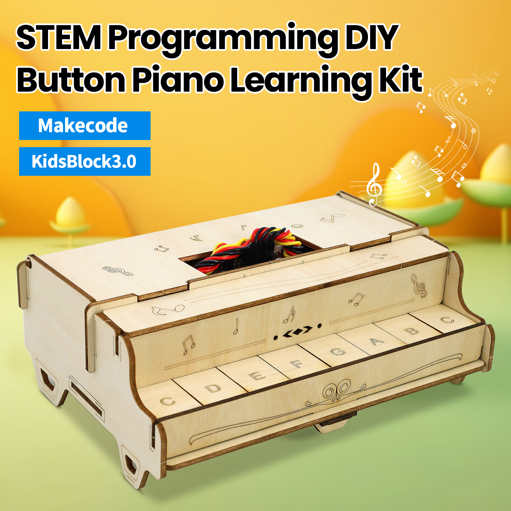

------

## Kit List

**Please check the list to ensure that all parts are intact. If you find missing ones, please contact our sales staff immediately.**

|  #   |                             PIC                              |       NAME       | QTY  |
| :--: | :----------------------------------------------------------: | :--------------: | :--: |
|  1   |                      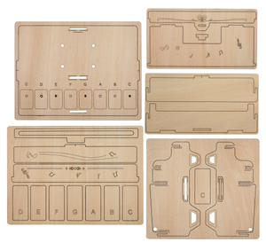                      |     Basswood     |  1   |
|  2   |                                            | Expansion board  |  1   |
|  3   |                                            |  Button module   |  8   |
|  4   |                                            |  Battery holder  |  1   |
|  5   |     | M4 copper pillar |  4   |
|  6   | 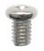 |   M4*6mm screw   |  8   |
|  7   |  |  M3*10mm screw   |  8   |
|  8   |  |      M3 nut      |  8   |
|  9   |                                            | 3PIN DuPont wire |  8   |
|  10  |                                           |   Screwdriver    |  1   |

------

## Introduction

With basswood as a structural material, this unique piano learning kit integrates eight button modules as well as micro:bit mainboard or ESP-32 Easy Coding Board as its main control board. Besides, a built-in buzzer of the board enables it to play scales of do, re, mi, fa, so, la,si and Do .

To write codes featuring more creation and interestingness, we design this kit which is compatible with multiple programming software, such as makecode and KidsBlock3.0. With this kit, you can not only master the basics of piano skills, but also enjoy an excellent opportunity to learn programming, which largely stimulate your creativity and talent. Wish you a wonderful experience with enchanting music and a perfect combination of learning and entertainment!

------

## Features

1. **Environment-friendly:** This kit adopts environment-friendly materials, which are green and sustainable.
2. **Easy assembly:** For convenience and efficiency, the assembly process is very easy.
3. **Piano experience:** You may enjoy the fun of music with this piano.
4. **Music in programming:** It integrates music learning with programming to provide you with a brand-new programming experience.
5. **Multiple programming languages:** It can be enabled by Makecode or KidsBlock, which perfectly meet diversified programming needs and expand the possibility of learning.

------

## Assembly

### step 1

#### 1. Required components

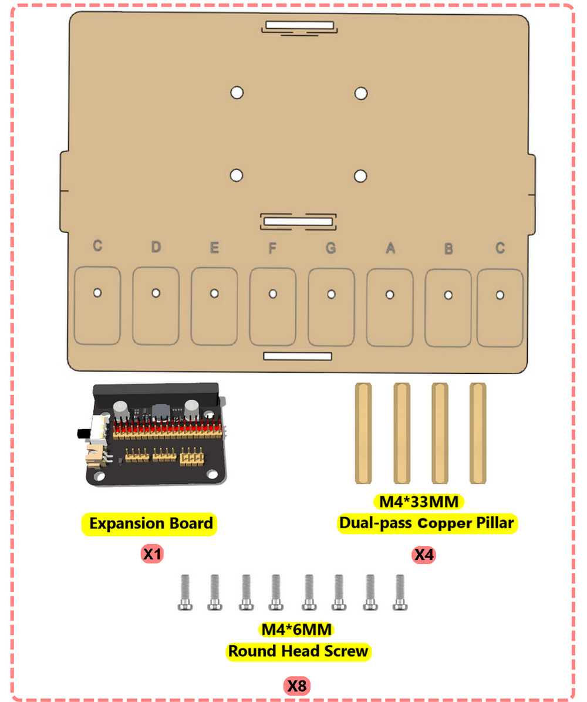

------

#### 2.

------

#### 3.

------

#### 4.

------

### step 2
#### 1. Required components

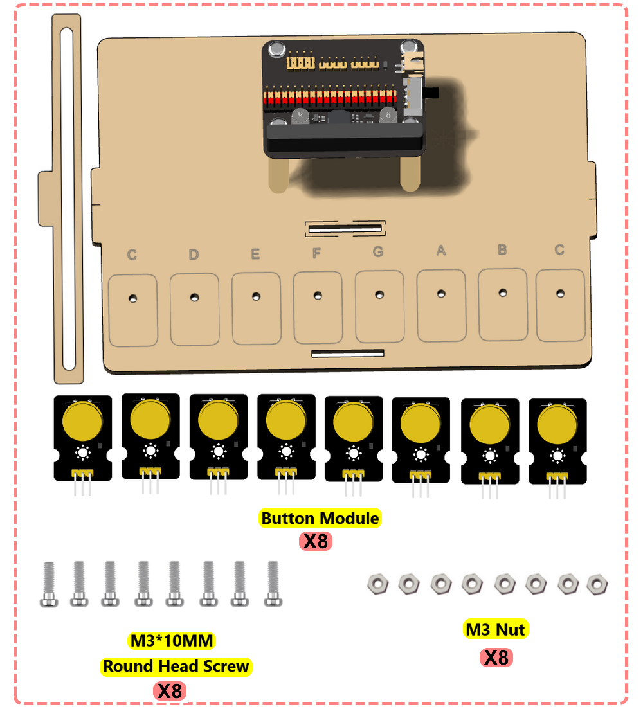

------

#### 2.

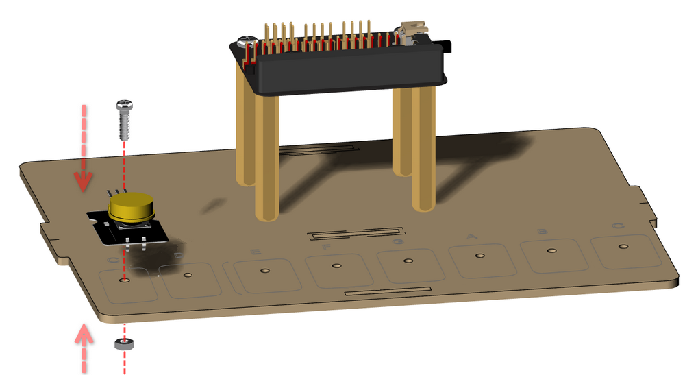

------

#### 3.

------

#### 4.

------

#### 5.

------

#### 6.

------

#### 7.

------
### step 3
#### Wiring

**DuPont wires:**

| DuPont wires | Expansion board | Modules |
| :----------: | :-------------: | :-----: |
|  Black wire  |       GND       |    G    |
|   Red wire   |       3V3       |    V    |
| Yellow wire  |        S        |    S    |

**Buttons pins:**

| Button |    Pin     |
| :----: | :--------: |
|   C    | P1 \|io14  |
|   D    |  P8 \|io4  |
|   E    | P12 \|io15 |
|   F    | P2 \|io32  |
|   G    | P13 \|io18 |
|   A    | P14 \|io19 |
|   B    | P15 \|io23 |
|   C    | P16 \|io5  |

------

------

------

**Tidy up the DuPont wires.**

------

------

#### 1. Required components

------

#### 2.

------

#### 3.

------

#### 4.

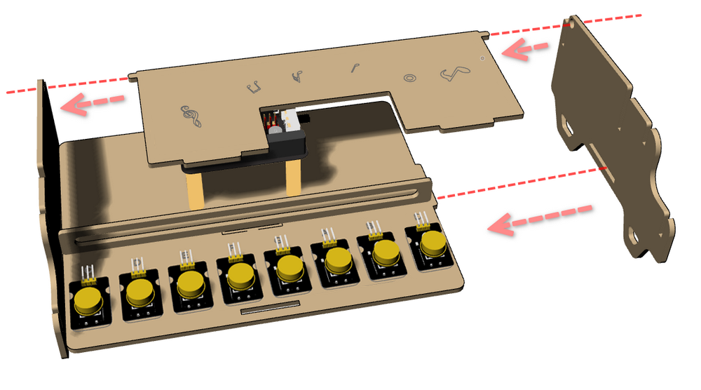

------

#### 5.

------

#### 6.

------
### step 4
#### 1. Required components

------

#### 2.

------

#### 3.

------

#### 4.

------

#### 5.

Lift the cover and insert the center plate.

------

------

#### 6.

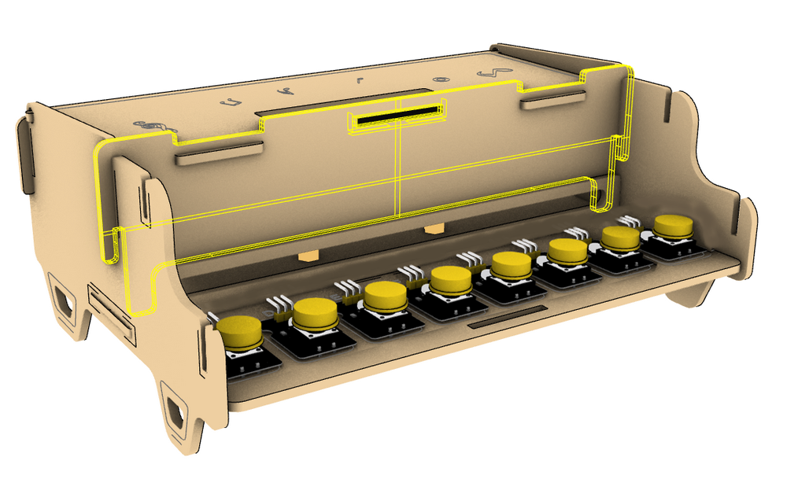

------

#### 7.

------

------
### step 5
#### 1. Required components

------

#### 2.

------

#### 3.

------

#### 4.

------

#### 5.

------

#### 6.

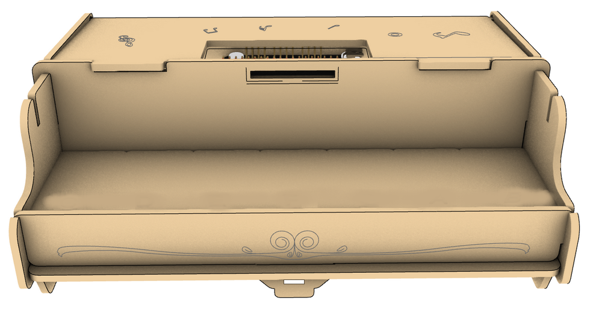

------

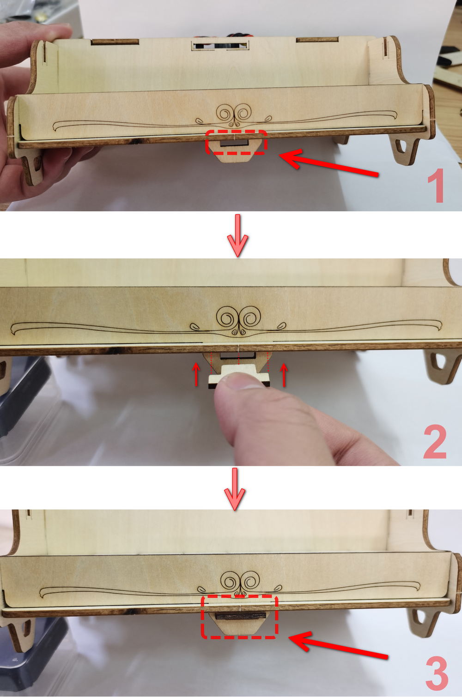

------

------
### step 6
#### 1. Required components

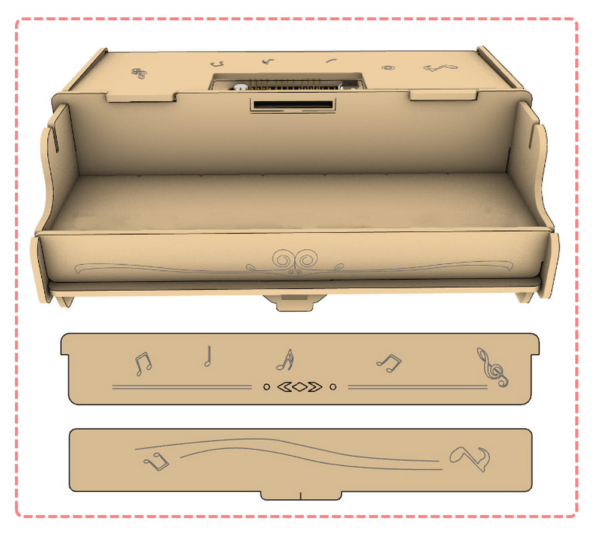

------

#### 2.

------

#### 3.

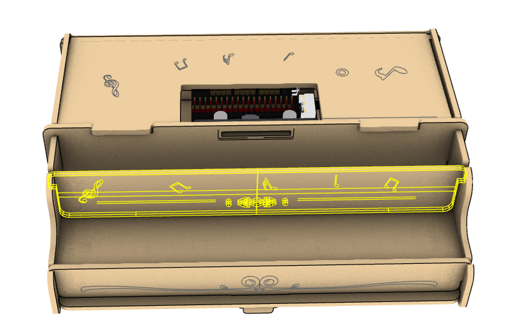

------

#### 4.

------

#### 5.

------

#### 6.

#### 7.

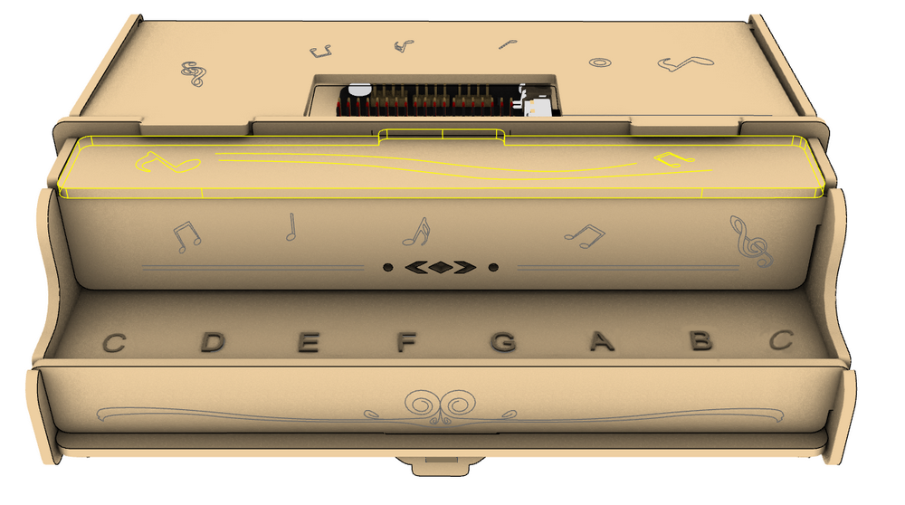

------

### Profile Display

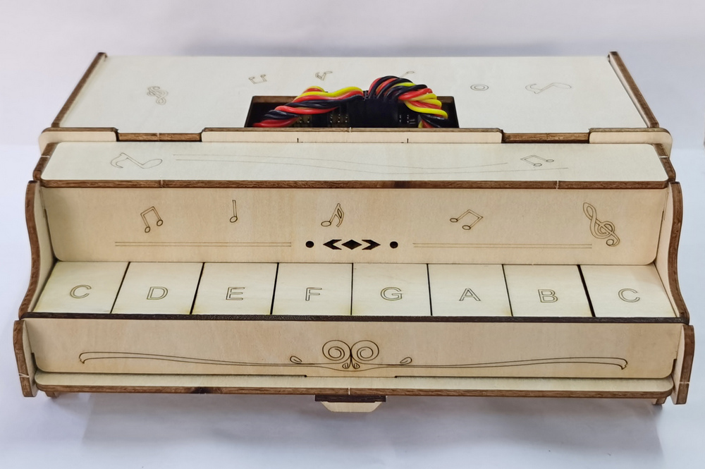

------------------

### Battery

**4 AAA batteries are required. Please do not reverse them!**

**NOTE: red for +, black for -**

After place the batteries, connect the wires to the expansion board and put the battery holder into the inner box of the piano. At last, mount the cover. 

**Wiring Diagram**

------

## Resources

[https://www.keyestudio.com/](https://www.keyestudio.com/)

[https://wiki.keyestudio.com/Main_Page](https://wiki.keyestudio.com/Main_Page)

[Micro:bit Educational Foundation | micro:bit (microbit.org)](https://microbit.org/)

<https://tech.microbit.org/hardware/>

<https://microbit.org/new-microbit/>

<https://www.microbit.org/get-started/user-guide/overview/>

<https://microbit.org/get-started/user-guide/features-in-depth/>

[https://www.espressif.com/](https://www.espressif.com/)

------

## Tutorial

[Micro:bit](Microbit/Microbit.md)

[ESP32](ESP32/ESP32.md)

------

